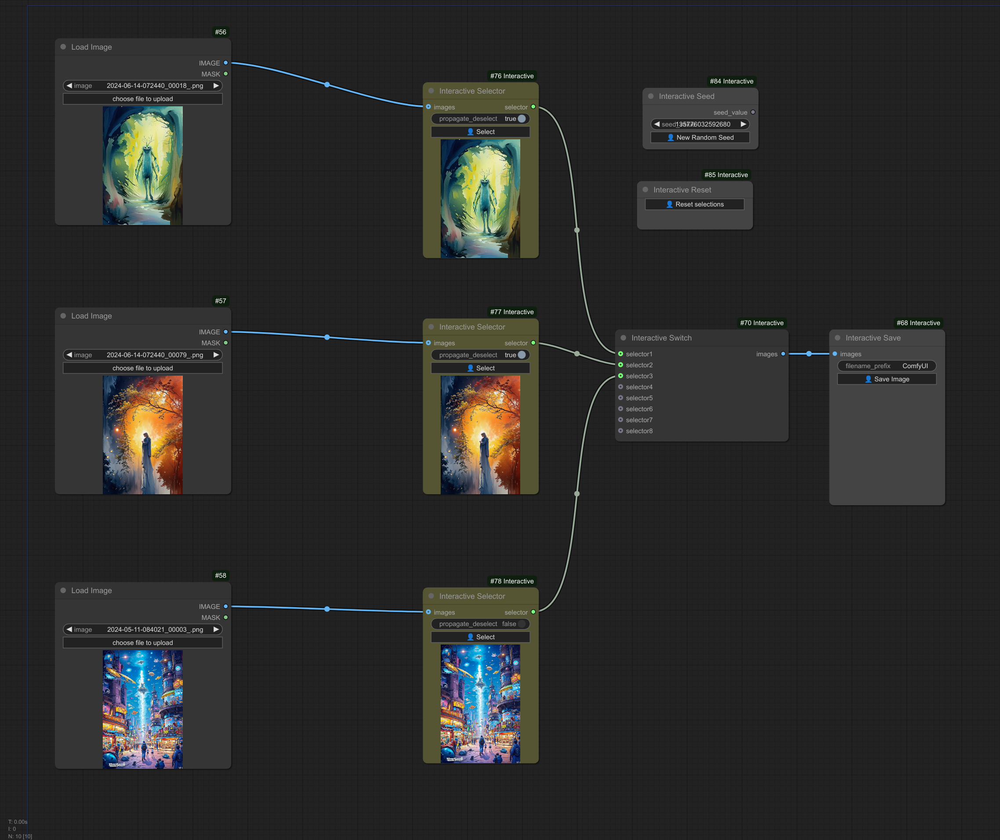
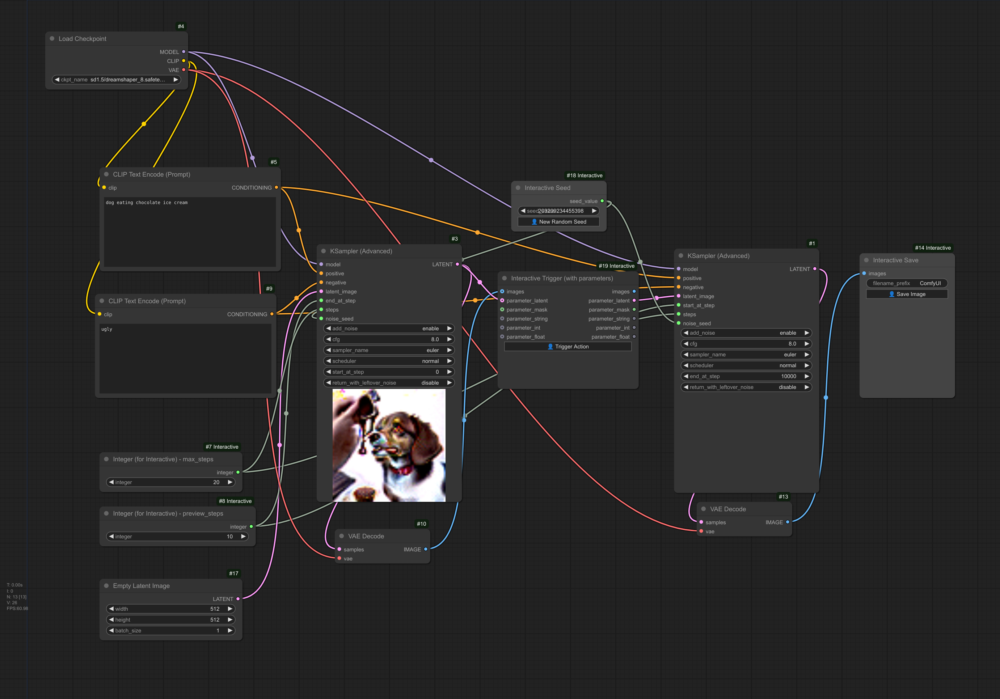

ComfyUI-Interactive

Copyright (c) 2024, Luis Quesada Torres - https://github.com/lquesada | www.luisquesada.com

Check ComfyUI here: https://github.com/comfyanonymous/ComfyUI

# Overview

These nodes allow setting up interactive workflows.

Several "Interactive Selector" nodes may be plugged to an "Interactive Switch". Selector nodes contain a button that the user can press to select that path of execution and continue execution.

The "Interactive Trigger" only allows execution to progress when a button is pressed.

The simple versions of the nodes show and pass an image. The "with parameters" versions of the nodes show and pass the image (optional), but also passes a latent, mask, string, int, and float.

The "Interactive Save" node previews images and contains a button that triggers saving the image.

The "Interactive Seed" node provides seeds and contains a button that triggers generating a new seed.

The "Interactive Reset" node deselects all selectors.

The "String (for Interactive)", "Integer (for Interactive)" and "Float (for Interactive)" nodes allow defining literals, which may be used to pass through different triggers.

The "String Append (for Interactive)" node appends two strings together. Use this node to append strings (e.g. prompts) together in interactive workflows, see "Best Practices" section below.

These nodes do not require auto-enqueue but need an empty queue to work, so that ComfyUI is responsive.

# Video Tutorial

Coming soon!

## Example (Simple)

This example uses "Interactive Selector" and "Interactive Switch" nodes to propagate one chosen image forward, and an "Interactive Save" node to gate saving an image on a button click.

Download the example workflow from [here](interactive_example_workflow_simple.json) or drag and drop the screenshot into ComfyUI.



## Example (Parameters)

This example uses "Interactive Selector (with parameters)" and "Interactive Switch (with parameters)" nodes to propagate one chosen image forward together with the accompanying parameters, and an "Interactive Save" node to gate saving an image on a button click.

Download the example workflow from [here](interactive_example_workflow_with_parameters.json) or drag and drop the screenshot into ComfyUI.


## Example (Trigger)

This example uses an "Interactive Trigger" node on a low-step preview to gate moving on with more sampling steps, and an "Interactive Save" node to gate saving an image on a button click.

Download the example workflow from [here](interactive_example_workflow_trigger.json) or drag and drop the screenshot into ComfyUI.



## Example (Full workflow with several options per step)

This example uses SDXL Turbo to quickly sample images, and uses several rounds of "Interactive Selector (with parameters)" and "Interactive Switch (with parameters)" nodes to allow the user to pick between three options, three times in a row.

This node requires the [Anything Everywhere](https://github.com/chrisgoringe/cg-use-everywhere) nodes to avoid plenty of manual connections. Note though that there must be a directly or indirectly linked path (i.e. without anything everywhere nodes) from interactive nodes so that they work properly.

Download the example workflow from [here](interactive_example_workflow_full.json) or drag and drop the screenshot into ComfyUI.


# Installation Instructions

Install via ComfyUI-Manager or go to the custom_nodes/ directory and run ```$ git clone https://github.com/lquesada/ComfyUI-Interactive.git```

## Best Practices
Keep an empty queue with auto-enqueue disabled while using interactive workflows.

Be aware that some nodes may not interact well with these interactive nodes. For example:
-   cg-use-everywhere "Anything Everywhere" nodes: if these nodes are used to connect between selectors and switches, interactive nodes may not be able to propagate state correctly.
-   Custom-Scripts "String Function" node: this node seems to have an issue when showing the concatenated text that makes it necessary to retrigger execution of some nodes. This slows down interactive workflows. Instead, use the "String Append" node included in this repository.

# Changelog
## 2024-11-14
- Initial commit.

# License
GNU GENERAL PUBLIC LICENSE Version 3, see [LICENSE](LICENSE)
